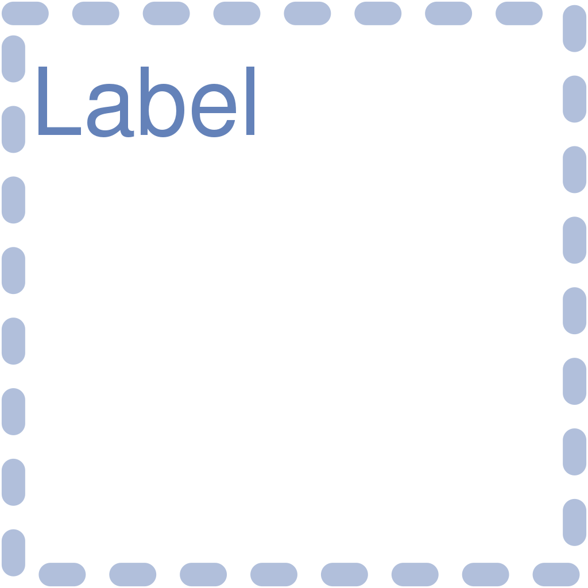
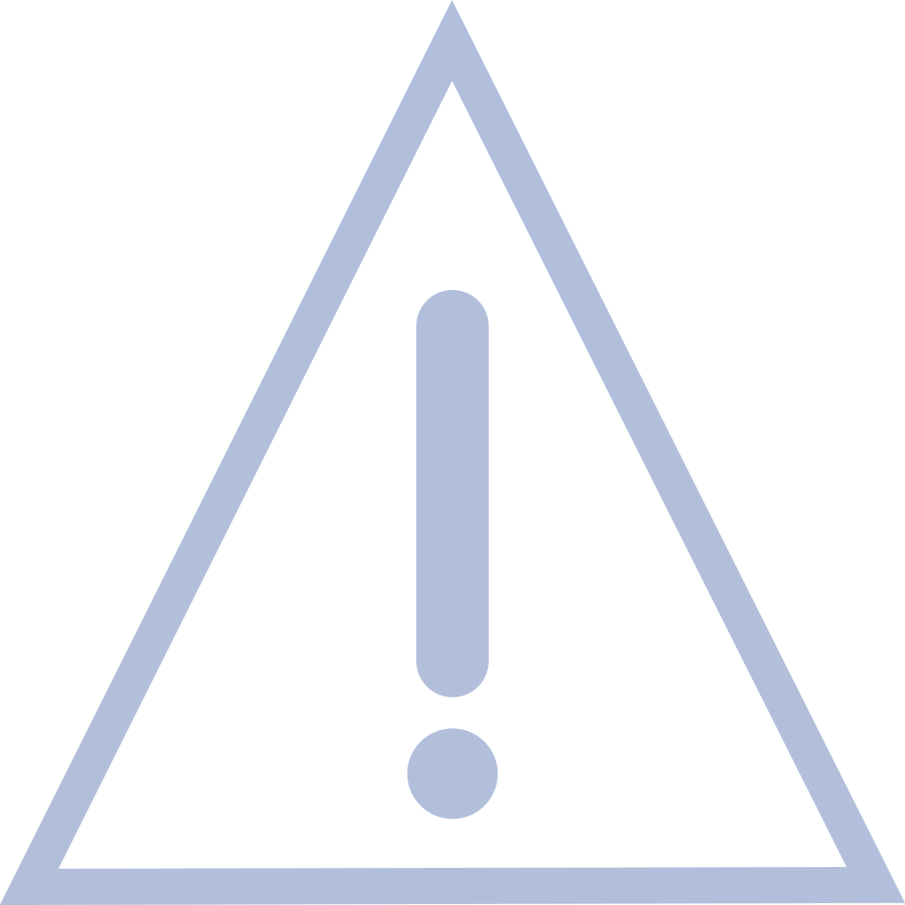
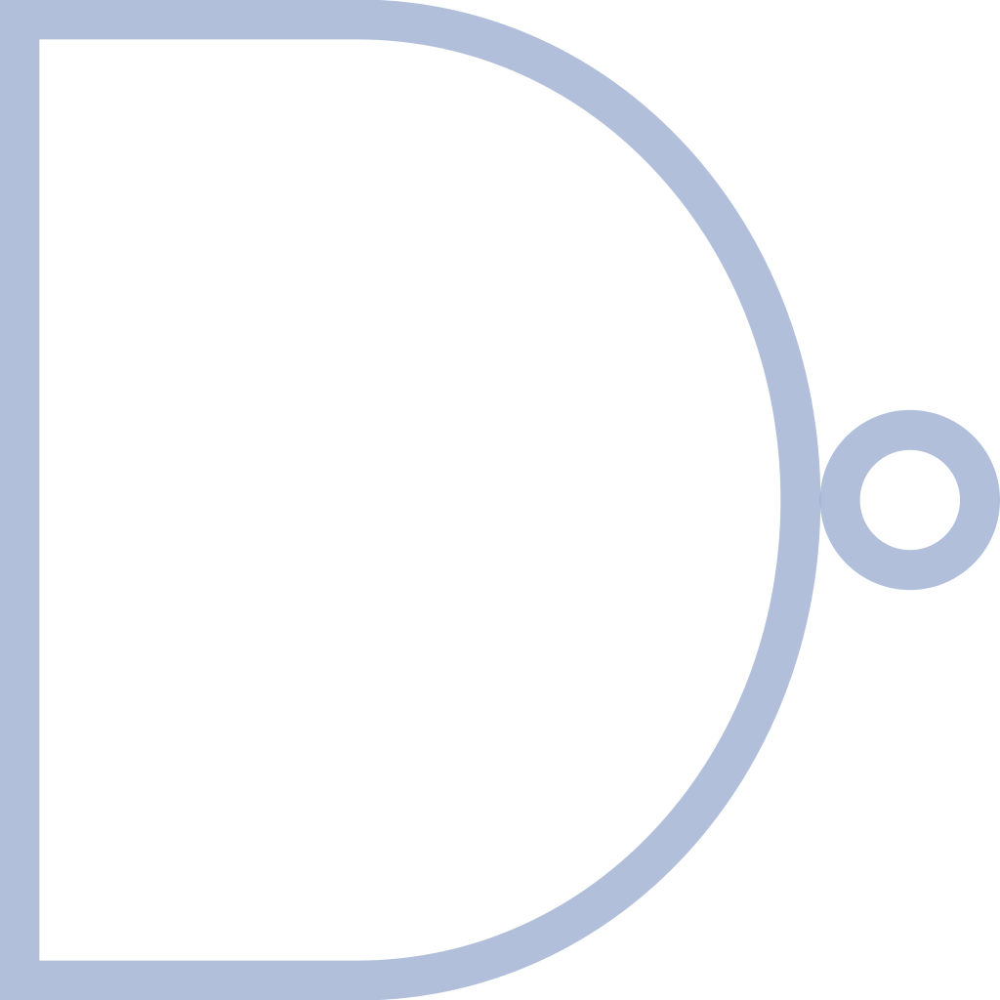
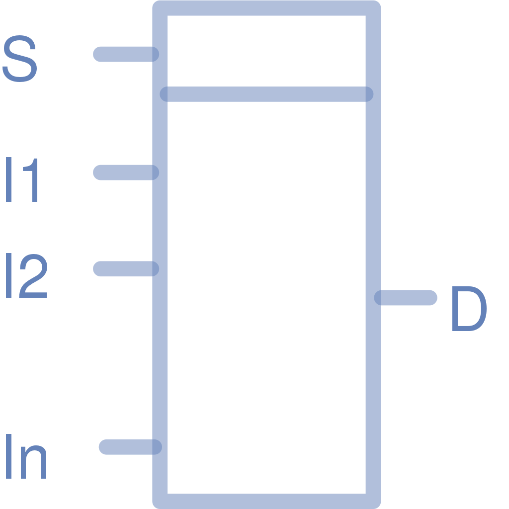
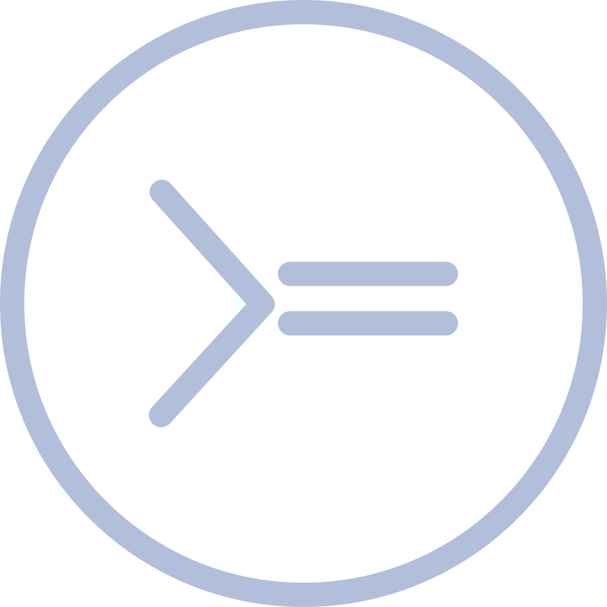
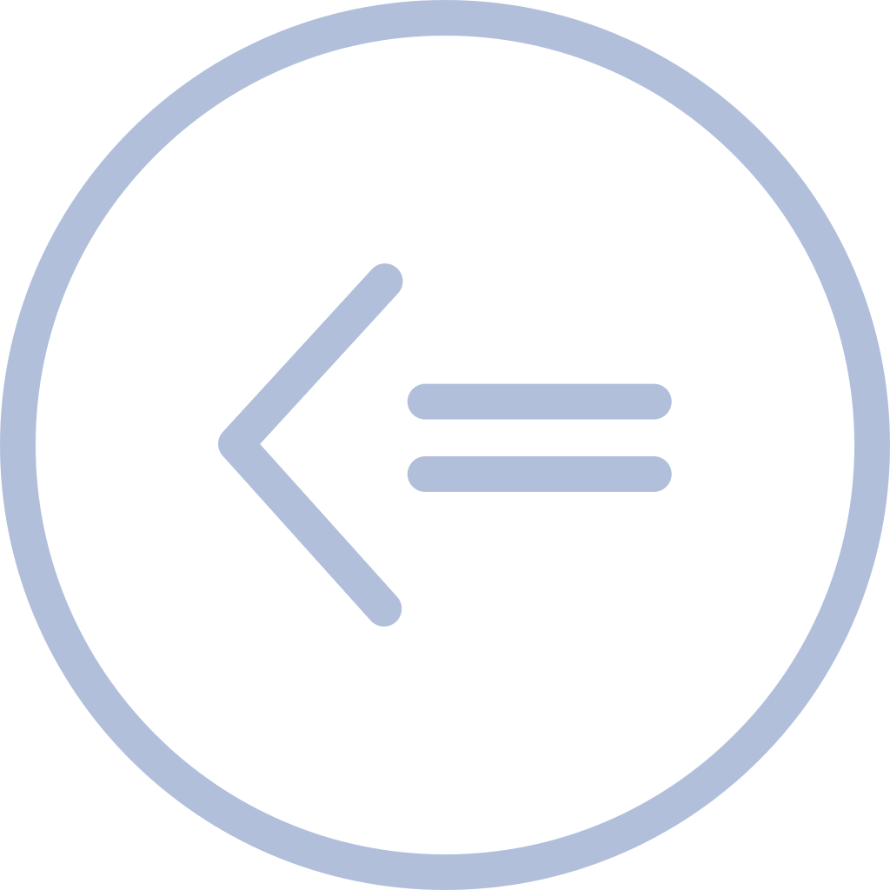
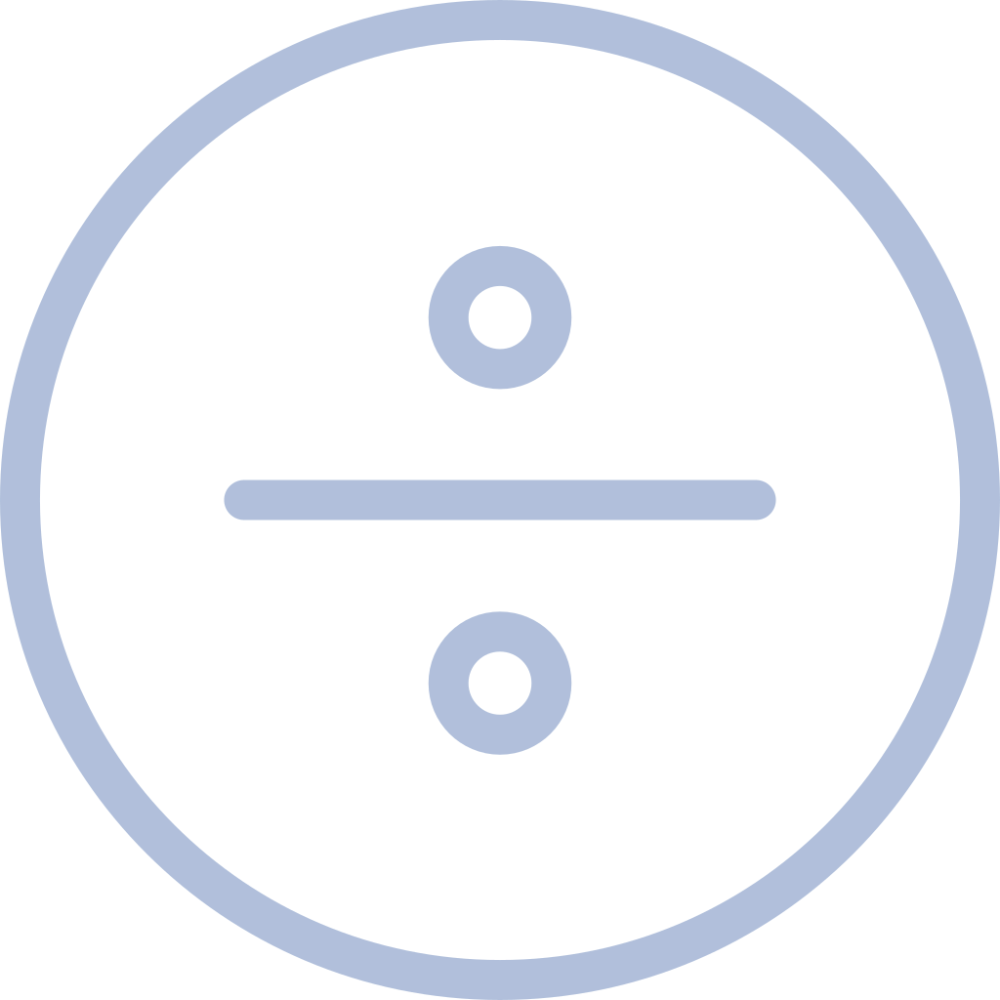
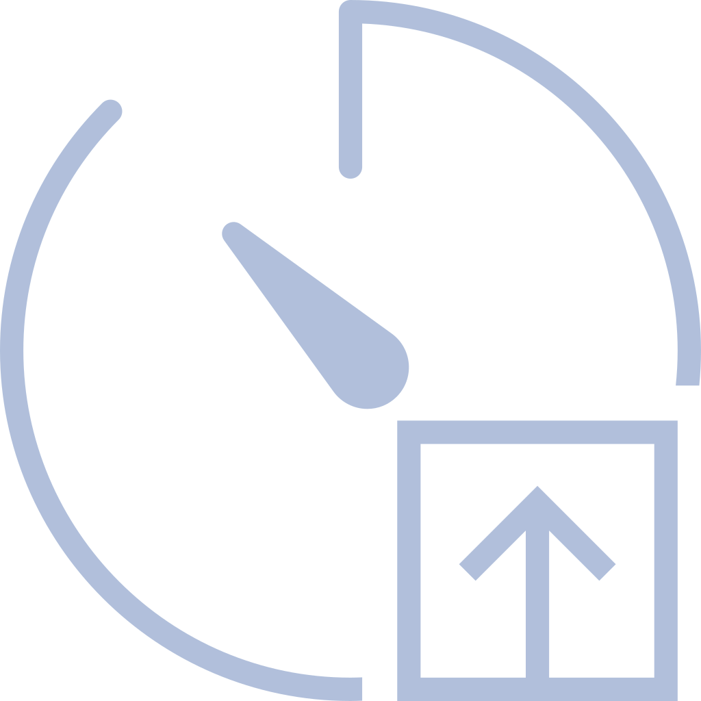
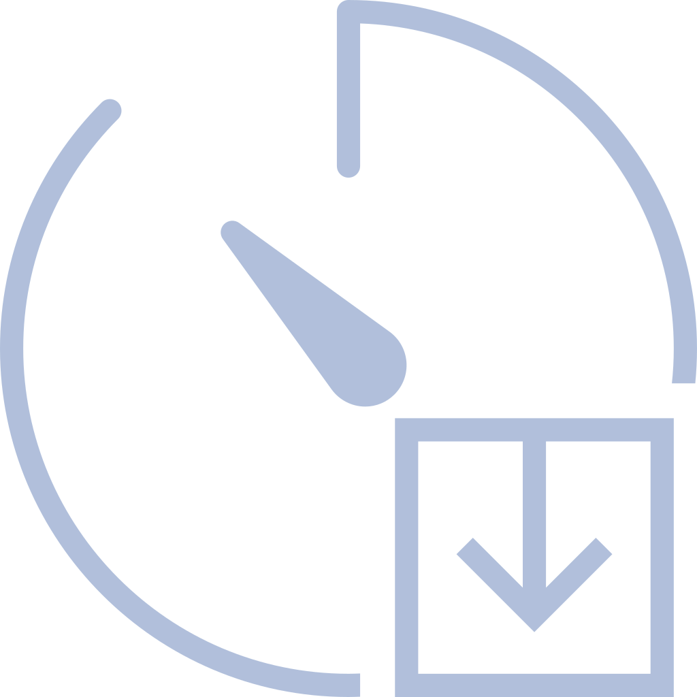

# User Manual <small><small><small>Rev 1.0</small></small></small>
*Copyright Information 
2023-2023 Oceanic Systems (UK) LTD. All Rights Reserved. 
This document is subject to change and revision without notice. No part of this document may be reproduced in any form by any photographic, electronic, mechanical or other means, or used in any information storage and retrieval system, without prior written permission from Oceanic Systems. 
All other product and brand names in this document are trademarks or registered trademarks of their respective owners.*
## I. The menu system
### I / 1. The file menu
It can be found on top left side of the main screen.

*The elements are:*

    New     Creates new settings
    Open    Opens existing settings
    Check   Checks the current logic diagram 
    Save    Saves current settings
### I / 2. The main menu
It can be found below of the file menu.

*The elements are:*

[Alarm Setup](#ii-the-alarm-definition-screen) - Selects alarm definition screen
[Logic Rules](#iii-the-logic-diagram-screen) - Selects logic diagram screen
[MODBUS Setup](#iv-the-modbus-definition-screen) - Selects MODBUS definition screen
[User Manual](#user-manualrev-10) - Selects manual screen
## II. The alarm definition screen
The defined alarms will be used in logic definitions to rise alarms in certain conditions. These alarms will be shown and can be handled in Poseidon alarm widget.

*This screen consists of 3 definition areas:*

[Alarm groups](#ii--1-creating-or-modifying-alarm-group-definitions) - Alarm group definitions
[Alarm Zones](#ii--2-creating-or-modifying-alarm-zone-definitions) - Alarm zone definitions
[Alarms](#ii--3-creating-or-modifying-alarm-definitions) - Alarm definitions

*Each area has control menu at the bottom of the area (in order):*

    Add             Creates new area definition
    Edit            Edits area definition
    Delete          Deletes area definition
### II / 1. Creating or modifying alarm group definitions
Creating new alarm group:

    Push the "Add" button of the bottom menu.
    It opens alarm group setup popup with editable title.
    Push the "Save" button at the bottom of popup to create new alarm group with the given title.
Editing alarm group:

    Push the "Edit" button of the bottom menu.
    It opens alarm group setup popup with editable title.
    Push the "Save" button at the bottom of popup to modify alarm group with the given title.
Deleting alarm group:

    Push the "Delete" button of the bottom menu.
    It opens a confirmation popup.
    Push the "Yes" button at the bottom of popup to delete alarm group.
### II / 2. Creating or modifying alarm zone definitions
Creating new alarm zone:

    Push the "Add" button of the bottom menu.
    It opens alarm zone setup popup with editable title and sounders definition.
    The sounders definition area of the screen makes possible to attach sounders to the alarm zone definition.
    This area also has bottom menu similar to previous area control menu.
    Push the "Save" button at the bottom of popup to create new alarm zone with the given content.
Editing alarm zone:

    Push the "Edit" button of the bottom menu.
    It opens alarm zone setup popup with editable title and sounders definition. For sounders definition see previous section.
    Push the "Save" button at the bottom of popup to modify alarm zone with the given content.
Deleting alarm zone:

    Push the "Delete" button of the bottom menu.
    It opens a confirmation popup.
    Push the "Yes" button at the bottom of popup to delete alarm zone.
Creating new sounder:

    Push the "Add" button of the sounder area bottom menu.
    It opens sounder setup popup with editable title, bus and instance.
    The bus parameter is the CAN line number, the instance is the sounder instance or 255 for all sounders on the bus.
    Push the "Save" button at the bottom of popup to create new sounder with the given content.
Editing sounder:

    Push the "Edit" button of the sounder area bottom menu.
    It opens sounder setup popup with editable title, bus and instance. For sounder definition see previous section.
    Push the "Save" button at the bottom of popup to modify sounder with the given content.
Deleting sounder:

    Push the "Delete" button of the sounder area bottom menu.
    It opens a confirmation popup.
    Push the "Yes" button at the bottom of popup to delete sounder.
### II / 3. Creating or modifying alarm definitions
Zone definiton is optional for alarms. Only alarm definitions with zone definitions will sound on the attached sounders.

Creating new alarm:

    Push the "Add" button of the bottom menu.
    It opens alarm setup popup with selectable group, editable title, description, selectable zone definition, editable silencing and ON/OFF delays.
    Push the "Save" button at the bottom of popup to create new alarm group with the given title.
Editing alarm:

    Push the "Edit" button of the bottom menu.
    It opens alarm setup popup with editable selectable group, editable title, description, selectable zone definition, editable silencing and ON/OFF delays.
    Push the "Save" button at the bottom of popup to modify alarm group with the given title.
Deleting alarm:

    Push the "Delete" button of the bottom menu.
    It opens a confirmation popup.
    Push the "Yes" button at the bottom of popup to delete alarm.
## III. The logic diagram screen

*Logic diagram content:*

[The logic page selector](#iii--1-the-logic-page-selector)
[The logic drawing area](#iii--2-the-logic-drawing-area)
[The logic bottom menu](#iii--3-the-logic-bottom-menu)

[The available logic components](#iii--4-the-available-logic-components)

*Logic diagram manupulation:*

[Creating or modifying the logic](#iii--5creating-or-modifying-the-logic)
[Loading existing logic](#iii--6-loading-existing-logic)
[Saving curren logic](#iii--7-saving-current-logic)

### III / 1. The logic page selector
It can be found on top right side of the logic diagram screen. 
This horizontal bar is made for create a new one or selecting between logic diagram pages.
### III / 2. The logic drawing area
It can be found below the logic page selector bar. It is filled with dots for the proper positioning of the logic elements and connections.
### III / 3. The logic bottom menu
It can be found below the logic drawing area.

*The buttons (in order):*

    Zoom In         Increases magnification of logic draw area
    Zoom to 100%    Sets back maginifitaion to 100%
    Zoom Out        Decreases magnification of logic draw area
    Undo            Discards the last change of drawing
    Redo            Recovers previous discard
    Add             Creates new logic component

*If there are selected component(s) or connection(s):*

    Edit            Edits selected component properties
    Delete          Deletes the selection
    Copy            Copies selection to the clipboard
    Cut             Copies selection to the clipboard and removes after paste
    Paste           Inserts selection from the clipboard
## III / 4. The available logic components

The components (in order):

[1. Group box](#iii--4--1-group-box)
[2. Sensor input](#iii--4--2-sensor-input)
[3. Sensor output](#iii--4--3-sensor-output)
[4. Alarm input](#iii--4--4-alarm-input)
[5. Alarm output](#iii--4--5-alarm-output)
[6. Virtual input (for screen connections)](#iii--4--6-virtual-input-for-screen-connections)
[7. Virtual output (for screen connections)](#iii--4--7-virtual-output-for-screen-connections)
[8. Logic gates](#iii--4--8-logic-gates)

    8/1. AND gate
    8/2. OR gate
    8/3. XOR gate
    8/4. NOT gate
    8/5. NOR gate
    8/6. NAND gate
    8/7. SR Flip-flop
    8/8. Selector

[9. Comparators](#iii--4--9-comparators)

    9/1. Greater then
    9/2. Greater or equal
    9/3. Lower then
    9/4. Lower or equal
    9/5. Equal
    9/6. Not equal

[10. Math elements](#iii--4--10-math-elements)

    10/1. Addition
    10/2. Substraction
    10/3. Multiplication
    10/4. Division
    10/5. Modulo
    10/6. Absolute value
    10/7. Average value

[11. Timers](#iii--4--11-timers)

    11/1. Count up
    11/2. Count dowm
    11/3. Pulse timer

[12. Other components](#iii--4--12-other-components)

    12/1. Integrator
    12/2. Boolean delay
    12/3. Switch block
    12/4. Storage
    12/5. Script
    12/6. Propagation
    12/7. Pulse counter
    12/8. Encoder
    12/9. Decoder
    12/10. TRUE counter
    12/11. Mute State

### III / 4 / 1. Group box
Selector image:

Description:

    Summary:
    A group box helps to graphically group of components in a circuit.

    Input:  None
    Output: None
    Settings:
      Label:  Defines box title

### III / 4 / 2. Sensor input
Selector image:

Description:

    Summary:
    A sensor input takes live sensor data available on the system, and provides it to other logic component(s).
    It updates its' output when the sensor value is changed.

    Input:  None
    Output: Selected sensor data
    Settings:
      Protocol: NMEA2k, J1939
      Bus:      CAN line
      Message:  PGN
      Field:    PGN field

### III / 4 / 3. Sensor output
Selector image:

Description:

    Summary:
    A sensor output takes data from other logic component and provides it to live sensor on the system.
    It updates its' output when the input value is changed.

    Input:  Data of connected component
    Output: None
    Settings:
      Protocol: NMEA2k, J1939
      Bus:      CAN line
      Message:  PGN
      Instance: Device instance (if applicable)
      Field:    PGN field

### III / 4 / 4. Alarm input
Selector image:

Description:

    Summary:
    An alarm input takes alarm state data available on the system, and provides it to other logic component(s).
    It updates its' output when the alarm state is changed.

    Input:          None
    Output:         Selected alarm state
    Settings:
      Group:        Engine, Transmission, General
      Bus:          CAN line (Engine, Transmission)
      Instance:     Device instance (Engine, Transmission)
      Discrete bit: Discrete bit (Engine, Transmission)
      Alarm:        Selected alarm (General)

### III / 4 / 5. Alarm output
Selector image:

Description:

    Summary:
    An alarm output takes data from other logic component and provides it to alarm engine on the system.
    It updates its' output when the input value is changed.

    Input:    Data of connected component
    Output:   None
    Settings:
      Group:  General (only)
      Alarm:  Selected alarm

### III / 4 / 6. Virtual input (for screen connections)
Selector image:

Description:

    Summary:
    A virtual input takes data from screen element, and provides it to other logic component(s).
    It updates its' output when the screen data is changed.

    Input:   None
    Output:  Data of screen element
    Settings:
      Description:  Individual name for identification

### III / 4 / 7. Virtual output (for screen connections)
Selector image:

Description:

    Summary:
    A virtual output takes data from other logic component and provides it to a screen element.
    It updates its' output when the input value is changed.

    Input:    Data of connected component
    Output:   None
    Settings:
      Description:  Individual name for identification

## III / 4 / 8. Logic gates

Description:

    Summary:
    This gate takes data from other logic component(s) and after calculations provides it to another component(s).
    It updates its' output(s) when the input value(s) is changed.

    Inputs:   Data of connected component(s)
    Output:   Calculated data
    Settings:
      Inputs: Count of input pins

### III / 4 / 8 / 1. AND gate
Selector image:

Calculation:

    Generates logic "AND" value of inputs.

Truth table (for 2 inputs):

|I1|I2|O|
|:--:|:--:|:--:|
|0|0|0|
|0|1|0|
|1|0|0|
|1|1|1|

### III / 4 / 8 / 2. OR gate
Selector image:

Calculation:

    Generates logic "OR" value of inputs.

Truth table (for 2 inputs):

|I1|I2|O|
|:--:|:--:|:--:|
|0|0|0|
|0|1|1|
|1|0|1|
|1|1|1|

### III / 4 / 8 / 3. XOR gate
Selector image:

Calculation:

    Generates logic "XOR" value of inputs.

Truth table (for 2 inputs):

|I1|I2|O|
|:--:|:--:|:--:|
|0|0|0|
|0|1|1|
|1|0|1|
|1|1|0|

### III / 4 / 8 / 4. NOT gate
Selector image:

Calculation:

    Generates logic "NOT" value of input.

Truth table:

|I|O|
|:--:|:--:|
|0|1|
|1|0|

### III / 4 / 8 / 5. NOR gate
Selector image:

Calculation:

    Generates logic "NOR" value of inputs.

Truth table (for 2 inputs):

|I1|I2|O|
|:--:|:--:|:--:|
|0|0|1|
|0|1|0|
|1|0|0|
|1|1|0|

### III / 4 / 8 / 6. NAND gate
Selector image:

Calculation:

    Generates logic "NAND" value of inputs.

Truth table (for 2 inputs):

|I1|I2|O|
|:--:|:--:|:--:|
|0|0|1|
|0|1|1|
|1|0|1|
|1|1|0|

### III / 4 / 8 / 7. SR Flip-Flop (latch)
Selector image:

Description:

    Summary:
    The SR flip-flop is the 1-bit bistable memory device having two inputs, SET and RESET.
    The SET input S sets the device or generates the output Q as 1 and Q' as 0.
    The RESET input R resets the device or generates the output Q as 0 and Q' as 1.

    Inputs:   S (set), R (reset)
    Outputs:  Q, Q'
    Settings: None

Truth table:

|S|R|Q|Q'|State|
|:--:|:--:|:--:|:--:|:--:|
|0|0|Previous||No change|
|0|1|0|1|Reset|
|1|0|1|0|Set|
|1|1|?|?|Invalid|

### III / 4 / 8 / 8. Selector
Selector image:

Description:

    Summary:
    This component takes data from other logic component(s) and provides selected data to another component(s).
    It updates its' output when the input value(s) is changed.

    Inputs:   Selector, Data1 ... DataN
    Output:   The selected value
    Settings:
      Inputs: Count of inputs

Calculation:

    Propagates the selected input value to the output.
    The 'Selector' input value is a number between 1 ... N which makes the selection between Data1 ... DataN.

## III / 4 / 9. Comparators
Description:

    Summary:
    This component takes data from other logic component and after calculations provides it to another component(s).
    It updates its' output when the input value is changed.

    Input(s):   Data of connected component(s)
    Output:     Calculated data
    Settings:
      Data:   If defined, data value to compare with otherwise the second input value used by the comparison.

### III / 4 / 9 / 1. Greater then
Selector image:

Calculation:

    Propagates true if input value greater then the data provided.

### III / 4 / 9 / 2. Greater or equal
Selector image:

Calculation:

    Propagates true if input value greater or equal then the data provided.

### III / 4 / 9 / 3. Lower then
Selector image:

Calculation:

    Propagates true if input value lower then the data provided.

### III / 4 / 9 / 4. Lower or equal
Selector image:

Calculation:

    Propagates true if input value lower or equal then the data provided.

### III / 4 / 9 / 5. Equal
Selector image:

Calculation:

    Propagates true if input value equal with the data provided.

### III / 4 / 9 / 6. Not equal
Selector image:

Calculation:

    Propagates true if input value not equal with the data provided.

## III / 4 / 10. Math elements
Description:

    Summary:
    This component takes data from other logic component(s) and after calculations provides it to another component(s).
    It updates its' output when the input value is changed.

    Inputs:   Data of connected component(s)
    Output:   Calculated data
    Settings: None

### III / 4 / 10 / 1. Addition
Selector image:

Calculation:

    Propagates sum of two or more input values.

### III / 4 / 10 / 2. Substraction
Selector image:

        
Calculation:

    Propagates difference of two or more input values.

### III / 4 / 10 / 3. Multiplication
Selector image:

Calculation:

    Propagates product of two or more input values.

### III / 4 / 10 / 4. Division
Selector image:

Calculation:

    Propagates quotient of two or more input values. The first input is always the divident the others are the divisors.

### III / 4 / 10 / 5. Modulo
Selector image:

Calculation:

    Propagates remainder of arithmetic divison of two input values.

### III / 4 / 10 / 6. Absolute value
Selector image:

Calculation:

    Propagates modulus of input value.

### III / 4 / 10 / 7. Average value
 

Calculation:

    Propagates average value of two or more input values.

## III / 4 / 11. Timers
Description:

    Summary:
    This component takes data from other logic component(s) and depending on the function provides count value or binary value to another component(s).
    It updates its' output(s) when the internal timer ticks or the input(s) value is changed.

### III / 4 / 11 / 1. Count up
Selector image:

Parameters:

    Inputs:   Enable (start/stop ticking), Reset (sets count to 0)
    Outputs:  Count (tick count), State (start/stop state)
    Settings:
      Reset Delay:  Delay after reset
      Interval:     Ticking interval
      Init value:   Count start value

Calculation:

    Propagates incremental count value on 'Count' output and running state on 'State' output.

### III / 4 / 11 / 2. Count dowm
Selector image:

Parameters:

    Inputs:   Enable (start/stop ticking), Reset (sets count to 0)
    Outputs:  Count (tick count), State (start/stop state)
    Settings:
      Reset Delay:  Delay after reset
      Interval:     Ticking interval
      Init value:   Count start value

Calculation:

    Propagates decremental count value on 'Count' output and running state on 'State' output.

### III / 4 / 11 / 3. Pulse timer
Selector image:

Parameters:

    Input:   Pulse (start)
    Output:  State
    Settings:
      Delay:    Tick count
      Interval: Ticking interval

Calculation:

    After getting pulse on input, propagates true value on the output for the Delay period then propagates false.

## III / 4 / 12. Other components
 
    
### III / 4 / 12 / 1. Integrator
Selector image:

    Summary:
    This component takes data from other logic component(s) and after calculations provides it to another component(s).
    It updates its' output when the input value is changed.

    Inputs:   Data of connected component, Reset (sets output to 0)
    Output:   Calculated data
    Settings:
      Reset Delay:  Delay after reset
      Interval:     Ticking interval
      Factor:       Multiplier of calculation
      Init value:   Calcualtion initial value

Calculation:

    Propagates the value of the following calculation to the output on every ticks:
      value = ((current + previous) / 2) * Factor 

### III / 4 / 12 / 2. Boolean delay
Selector image:

Description:

    Summary:
    This component takes data value from other logic component and if the input value is true starts a timer with the delay value and
    after timer stops propagates true value on the output if the input data value still true.
    If in meantime the input value changes to false the timer stops and propagates false value to the output.

    Input:   Data of connected component
    Output:  Delayed data value
    Settings:
      Delay:    Interval

### III / 4 / 12 / 3. Switch block
Selector image:

Description:

    Summary:
    This component takes data value from other logic component and depending on selector value provides the input value to the selected output.
    Provides "No data" value to all other outputs.

    Inputs:   Data of connected component, Selector
    Outputs:  Data to connected component(s)
    Settings:
      Outputs:  Count of outputs

### III / 4 / 12 / 4. Storage
Selector image:

Description:

    Summary:
    This component takes data value and stores into non-volitile memory from other logic component(s).
    The component duplicable which means all inputs and outputs connected to storage component with same Variable name accessing same memory variable.
    Initial value can be definded before any writing operation.
    It updates its' output when the input value is changed

    Input:    Data from connected component(s)
    Output:   Data to connected component(s)
    Settings:
      Variable:   Name of the storage variable
      Init Value: Inital data value

### III / 4 / 12 / 5. Script
Selector image:

Description:

    Summary:
    This component runs javascript code defined in the script block.
    The script can run in two modes:
      One shot - Any input changes activates the process of the script
      Loop - Continuous processing of the script

    Input(s):   Data from connected component(s)
    Output(s):  Data to connected component(s)
    Settings:
      Mode:         Script running mode
      Input count:  Number of input(s)
      Output count: Number of output(s)

### III / 4 / 12 / 6. Propagation
Selector image:

Description:

    Summary:
    This component takes data value from other logic component.
    It updates its' output when Enable value or the input value is changed

    Input(s):   Enable, (Data value from connected component)
    Output:     Data to connected component
    Settings:
      Delay:  Delay for propagation (optional)
      Data:   If defined, data value to propagate otherwise the second input value used for the propagation.

### III / 4 / 12 / 7. Pulse counter
Selector image:

Description:

    Summary:
    This component takes data value from other logic components.
    Counts pulses on Data input and propagates count value to output.
    It updates its' output when the input value or Reset value is changed.

    Input(s):   Data, Reset (set count = 0)
    Output:     Data to connected component
    Settings:   None

### III / 4 / 12 / 8. Encoder
Selector image:

Description:

    Summary:
    This component takes data value from other logic component.
    Splits input value into bits and propagates bit values to corresponding outputs. (bit0 -> O1, bit1 -> O2, ...)
    It updates its' output when the input value is changed.

    Input:      Data from connected component
    Outputs:    Data to connected components
    Settings:
      Outputs:  Count of output connections

### III / 4 / 12 / 9. Decoder
Selector image:

Description:

    Summary:
    This component takes data value from other logic components.
    Joins input bits into numeric value and propagates to output.
    (I1 -> bit0, I2 -> bit1, ...)
    It updates its' output when the input(s) value is changed.

    Inputs:   Data from connected component(s)
    Output:   Data to connected component
    Settings:
      Inputs:   Count of input connections

### III / 4 / 12 / 10. TRUE counter
Selector image:

Description:

    Summary:
    This component takes data value from other logic components.
    Counts inputs with true values and propagates count value to output.
    It updates its' output when the input(s) value is changed.

    Inputs:   Data from connected component(s)
    Output:   Data to connected component
    Settings:
      Inputs:   Count of input connections

### III / 4 / 12 / 11. Mute State
Selector image:

Description:

    Summary:
    This component propagates system's mute state value to output.
    It updates its' output when the mute state value is changed.

    Inputs:   None
    Output:   Data to connected component
    Settings: None

### III / 5. Creating or modifying the logic
Creating new page:

    Push the "New Page" button of the logic page selector horizontal bar.
    It creates new empty logic page.
Deleting page:

    If the page content is empty it will be not exported to the logic definition file.
    When the file next time loaded the page will be not showed in the new layout.
Creating new component:

    Push the "Add" button of the bottom menu.
    It opens the component properties popup.
    Depending on the component the popup opens with different content.
Copying component(s):

    Select component(s) [with connection(s)] using left mouse button.
    Press "Ctrl+C" on the keyboard or use "Copy" button of the bottom menu.
Cuting component(s):

    Select component(s) [with connection(s)] using left mouse button.
    Press "Ctrl+X" on the keyboard or use "Cut" button of the bottom menu.
    After paste the original selection will be deleted.
Pasteing component(s):

    Press "Ctrl+V" on the keyboard or use "Paste" button of the bottom menu.
    The component(s) will appear with a small bottom-righ offset of copied component(s) original position.
    The paste works on different page as well.
Moving component(s):

    Drag component with left mouse button and drop to the expected position.
    It will redraw all connections related to the component so after they need to be re-adjusted to avoid caotic layout.
Deleting component:

    Click left mouse button on component.
    Press "Del" on the keyboard or use "Delete" button of the bottom menu.
Creating new connection:

    Hover the mouse on source components output pin.
    When the green circle appears click left mouse button and hold.
    Hover to destination components input pin and release the button.
    It makes connection between the pins.
Justifying & deleting connection:

    Click left mouse button on connection line.
    To delete of the connection press "Del" on the keyboard or use "Delete" button of the bottom menu.
    Multiple selections are allowed.
    To justify of the connection is possible with dragging of the green squares along the connection path.
### III / 6. Loading existing logic
Pressing "Open" button in file menu opens the operating system's open file dialog. The default name for the logic definition is: "logic-export.json".
### III / 7. Saving current logic
Before saving the logic it's necessary to checking is there any unconnected pin left in the logic. 
The check is possible with pressing "Check" button of file menu. The checking procedure result apears in a popup. 
If no errors found, the "Save" button will be enabled in the file menu. Pressing "Save" button opens the operating system's save file dialog. 
It can be saved anywhere with any name. To able import the logic into kratos it should be saved on a USB stick's root with name: "logic-export.json".
## IV. The MODBUS definition screen
The defined MODBUS components will be used in logic definitions and Posedion sensor widget to attach input or output for MODBUS communication.

*This screen consists of 5 definition areas:*

    Device templates  Device definitions
    Device fields     Device field definitions

*Each area has control menu at the bottom of the area (in order):*

    Add             Creates new area definition
    Edit            Edits area definition
    Delete          Deletes area definition
### IV / 1. Creating or modifying device template definitions
Creating new device template:

    Push the "Add" button of the bottom menu.
    It opens device template setup popup with editable parameters.
    Push the "Save" button at the bottom of popup to create new device template with the given parameters.
Editing device template:

    Push the "Edit" button of the bottom menu.
    It opens device template setup popup with editable parameters.
    Push the "Save" button at the bottom of popup to modify new device template with the given parameters.
Deleting device template:

    Push the "Delete" button of the bottom menu.
    It opens a confirmation popup.
    Push the "Yes" button at the bottom of popup to delete device template.
### IV / 2. Creating or modifying device field definitions
Creating new device field:

    Push the "Add" button of the bottom menu.
    It opens device field setup popup with editable parameters.
    Push the "Save" button at the bottom of popup to create new device field with the given parameters.
Editing device field:

    Push the "Edit" button of the bottom menu.
    It opens device field setup popup with editable parameters.
    Push the "Save" button at the bottom of popup to modify new device field with the given parameters.
Deleting device field:

    Push the "Delete" button of the bottom menu.
    It opens a confirmation popup.
    Push the "Yes" button at the bottom of popup to delete device field.
